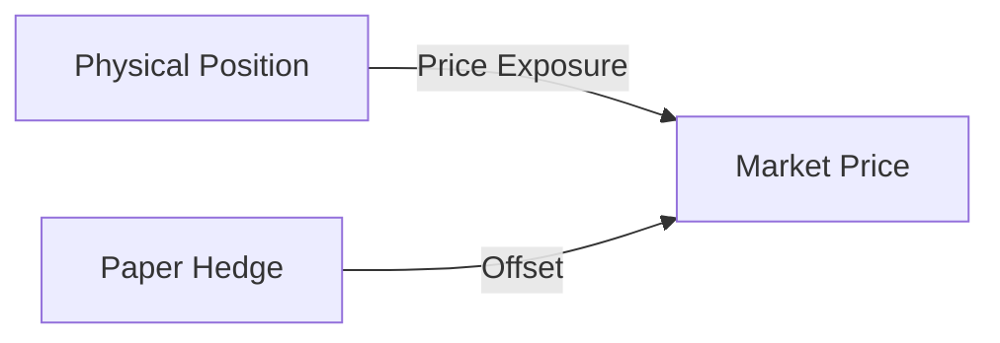
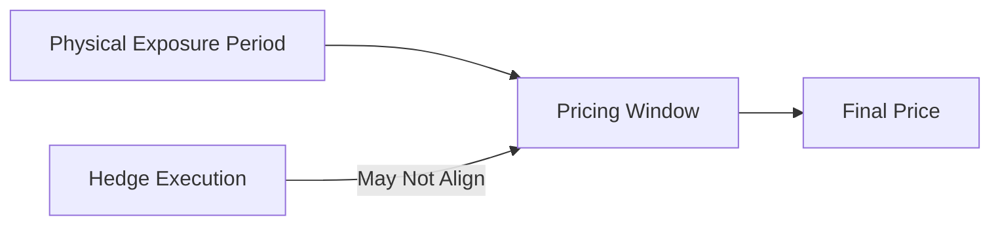

# Hedging Basics in Physical Commodity Trading

This document explains the **purpose, mechanics, and limitations of hedging** in physical commodity trading.

Hedging is not about eliminating risk. It is about **transforming risk into a form the desk can survive and manage**.

---

## 1. Why Physical Trades Need Hedging

A physical trade creates **price exposure over time**:
- Between contract signing and delivery
- Between delivery and pricing finalization
- Between inventory receipt and sale

During this time, market prices can move materially.

Without hedging, a trader is implicitly betting that:
- Market prices will not move against the position, or
- Operational execution will be perfect

Both assumptions are unsafe.

---

## 2. What Hedging Does (and Does Not Do)

### What Hedging Does
- Offsets **flat price risk**
- Reduces PnL volatility
- Protects margin and working capital

### What Hedging Does NOT Do
- Eliminate basis risk
- Protect against operational failures
- Guarantee profit
- Replace commercial judgment

Hedging converts **market risk** into **basis and execution risk**.

---

## 3. Identifying the Physical Exposure

Before hedging, the exposure must be defined precisely.

Key questions:
- Are you **long or short** the commodity?
- What is the **volume**?
- Over what **time window** does exposure exist?
- At what **pricing reference** will the trade be settled?

A hedge without a clearly defined exposure is speculation.

---

## 4. Common Hedging Instruments

### Exchange-Traded Futures
- Standardized contracts
- Transparent pricing
- Daily margining

Used when:
- Physical product closely matches futures contract
- Liquidity is sufficient

---

### OTC Swaps
- Customized pricing and tenors
- Settled financially

Used when:
- Physical exposure does not align perfectly with futures
- Credit relationships allow bilateral trading

---

### Options
- Provide asymmetric protection
- Require upfront premium

Used when:
- Downside protection is needed
- Upside participation is desired

---

## 5. Basic Hedge Structures

### Flat Price Hedge

The simplest hedge:
- Buy physical → sell futures
- Sell physical → buy futures

Objective:
Neutralize outright price movements.

## Proxy Hedge

Used when **no exact futures contract exists** for the physical exposure.

### Examples
- Hedging jet fuel with gasoil futures  
- Hedging regional coal with global benchmarks  

Proxy hedges introduce **basis risk by design**. They reduce flat price exposure but create residual risk that must be monitored and priced.

---

## 6. Timing Risk and Pricing Periods

Physical trades often price over:
- A future pricing window  
- An average of daily prices  
- A specific settlement date  

This creates **timing risk** when hedge execution does not align perfectly with the pricing mechanism.

If hedge timing does not match pricing timing, **residual exposure remains**, even when the trade appears fully hedged.

---

## 7. Volume Mismatch and Tolerance

Physical quantities are rarely exact due to:
- Loading tolerances  
- Measurement error  
- Losses and gains in transit  

Hedges are typically placed on **expected volumes**, creating:
- Over-hedge risk  
- Under-hedge risk  

Volume risk must be **monitored and adjusted dynamically** throughout execution.

---

## 8. Basis Risk: The Residual That Matters

Basis risk arises from:
- Product mismatch  
- Location mismatch  
- Timing mismatch  
- Quality mismatch  

It is the **dominant risk** in most hedged physical trades.

Professional desks:
- Measure basis historically  
- Price basis volatility explicitly  
- Avoid assuming basis is stable  

Ignoring basis risk is equivalent to **assuming the hedge will work perfectly under all conditions**.

---

## 9. Hedging and Cash Flow

Hedges introduce:
- Margin calls  
- Collateral requirements  
- Liquidity stress during volatility  

A hedged trade can fail due to **cash flow pressure**, even if it is economically sound.

Hedging must be planned alongside **working capital management**, not treated as a separate decision.

---

## 10. Common Hedging Failure Modes

- Hedging after price moves  
- Ignoring basis risk  
- Mismatching hedge tenor and exposure  
- Treating hedging as an afterthought  
- Separating trading and risk teams  

Most hedge losses result from **poor process**, not bad models.

---

## 11. Best Practices for Physical Traders

### Before Trading
- Define exposure clearly  
- Identify appropriate hedge instruments  
- Stress-test basis and cash flow  

### During Execution
- Monitor exposure daily  
- Adjust hedge volumes as reality evolves  
- Communicate across desks  

### After Completion
- Reconcile physical and paper PnL  
- Attribute residual PnL to specific risks  
- Feed insights back into pricing  

---

## Summary

Hedging does not remove uncertainty.  
It **moves uncertainty into places where discipline matters**.

Successful physical trading requires treating hedging as:
- A core part of trade structuring  
- A dynamic process  
- A source of insight, not comfort  

